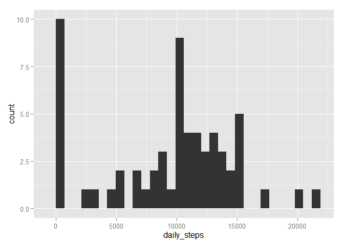
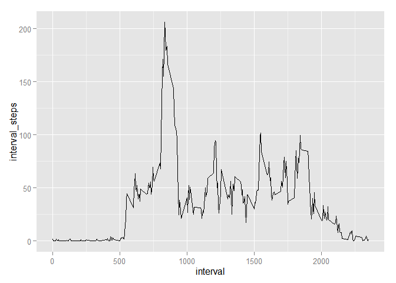
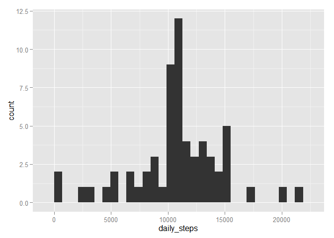
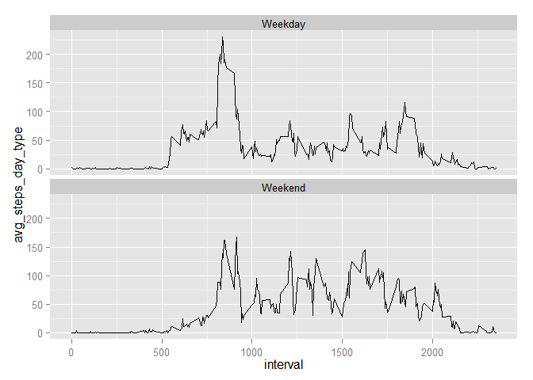

# Reproducible Research: Peer Assessment 1

## Loading the libraries that would be used for analyzing the data

The following code listed below  will perform the following:  
1. Clear the memory of R objects.  
2. Check for the existence of packages **dplyr** and **ggplot2**  
   +  If the packages exist, then it will load them  
   +  Else, it will install them and then load them.  


```r
rm(list=ls())
if(require("dplyr") == FALSE)
{
install.packages("dplyr")
library("dplyr")
}
```

```
## Loading required package: dplyr
## 
## Attaching package: 'dplyr'
## 
## The following object is masked from 'package:stats':
## 
##     filter
## 
## The following objects are masked from 'package:base':
## 
##     intersect, setdiff, setequal, union
```

```r
if(require("ggplot2") == FALSE)
{
install.packages("ggplot2")
library("ggplot2")
}
```

```
## Loading required package: ggplot2
```

## Loading and preprocessing the data
The data ("activity.zip") for this project was made available as part of the Github repository. 
The code listed below unzips the file and loads it into memory.

Unzipping the file and loading the file into memory

```r
unzip("activity.zip")
input_file_name <- list.files(pattern = ".csv")
activity_data <- read.csv(input_file_name)
```


Identifying the column names for the data-set.

```r
names(activity_data)
```

```
## [1] "steps"    "date"     "interval"
```

## What is mean total number of steps taken per day?

In order to address this question, we will perform the following:  
* Build a histogram of the total number of steps taken each day  
* Calculate & report the mean and median total number of steps taken each day.  

Preparing the data to address both steps

```r
steps_per_date <- activity_data %>%
                  select(steps,date)  %>% 
                  arrange(date)  %>% 
                  group_by(date)  %>% 
                  summarise(daily_steps = sum(steps,na.rm=TRUE))

mean_steps <- mean(steps_per_date$daily_steps)
median_steps <- median(steps_per_date$daily_steps)
```

The dataframe **steps_per_date** contains the summarised information of the steps per day.  
**mean_steps** and **median_steps** provide the average steps per day and the median.

Building the histogram of total number of steps taken each day.


```r
ggplot(steps_per_date,aes(x=daily_steps)) + geom_histogram()
```

```
## stat_bin: binwidth defaulted to range/30. Use 'binwidth = x' to adjust this.
```

 

The **mean** total steps per day is: 9354.2295082  

The **median** total steps per day is: 10395

## Determining the average daily activity pattern?
In order to determine the average daily activity pattern, we will build a timer series plot of the 5-minute interval (x-axis) and the average number of steps taken, averaged across all days (y-axis)

Computing the **average steps per interval** across the entire time period. 

```r
steps_per_interval <- activity_data %>%
                     select(interval,steps) %>%
                     arrange(interval) %>%
                     group_by(interval) %>%
                     summarise(interval_steps = mean(steps,na.rm=TRUE))
```

Visualizing the data using a time series plot:  

```r
ggplot(steps_per_interval,aes(x=interval,y=interval_steps))+
  geom_line()
```

 

Based on the above plot, we are able to identify that the peak activity for the individual happens in the morning. The below code will identify the exact interval with the most steps(average)


```r
interval_wth_max_steps <- steps_per_interval %>%
                          filter(interval_steps == max(interval_steps)) %>%
                          select(interval)
```

The interval that on average (across all days) that had the most number of steps would be: 835


## Handling for missing values

In the input dataset **activity_data.csv**, there are 2304 rows with no valid value for steps taken.

For those instances wherein the number of steps is listed as  **"NA"**, we have chosen to substitute it _with the average steps (across all days) for that interval._  

This is achieved by joining the following 2 datasets:  
1. The original dataset "activity_data"  
2. The dataset with average steps per interval "steps_per_interval"  

The 2 datasets are joined on the common column "interval". We then replace the steps for those instances where it is "NA". The resultant dataset is referred to as **new_activity_data**


```r
new_activity_data <- inner_join(activity_data,steps_per_interval,by="interval") %>%
                     mutate(steps = ifelse(is.na(steps),interval_steps,steps)
                           )
```

Plotting a histogram of  the total steps per day across the entire time period.

```r
new_steps_per_date <- new_activity_data %>%
                      select(steps,date)  %>% 
                      arrange(date)  %>% 
                      group_by(date) %>%
                      summarise(daily_steps = sum(steps))

new_mean_steps <- mean(new_steps_per_date$daily_steps)
new_median_steps <- median(new_steps_per_date$daily_steps)

ggplot(new_steps_per_date,aes(x=daily_steps)) + geom_histogram()
```

```
## stat_bin: binwidth defaulted to range/30. Use 'binwidth = x' to adjust this.
```

 

The **revised mean** total steps per day is: 1.0766189\times 10^{4}  

The **revised median** total steps per day is: 1.0766189\times 10^{4}

By imputing the missing data, we see an increase in the mean and median of the total daily number of steps.

## Determining the difference in activity patterns between weekdays and weekends?

In order to analyze the activity patterns between weekdays and weekends, we are adding a new column **day_type** to the **new_activity_data** dataset. The code listed below will:  
1. Compute the new column "day_type"  
2. Compute the Average steps taken averaged across all weekday days or weekend days  


```r
new_activity_data <- new_activity_data %>% 
                     mutate(day_num = as.POSIXlt(date)$wday,
                            day_type = as.factor(ifelse(day_num ==0,"Weekend",ifelse(day_num==6,"Weekend","Weekday")))
                           )

avg_steps_by_day_type <- new_activity_data %>%
                         group_by(day_type,interval) %>%
                         summarise(avg_steps_day_type = mean(steps))
```


Visualizing the data using line charts and splitting the data across 2 facets based on **day type**

```r
ggplot(avg_steps_by_day_type,aes(x=interval,y=avg_steps_day_type)) + 
  geom_line() + 
  facet_wrap(~ day_type, ncol=1)
```

 

Based on the above plots, the following observations can be made:  
* During the Weekday  
  + The individual is quite active between 8:00 AM and 9:00 AM and then the activity decreases.  
  + His/Her activity increases again for a short while (around 6:45 PM) in the evening but it is not as significant as the morning.  
* During the weekend  
  + We see a broader distrubtion of the steps taken through the day. The individual is active through the day.  
